<picture>
  <source media="(prefers-color-scheme: dark)" srcset="./assets/header-dark.svg">
  <source media="(prefers-color-scheme: light)" srcset="./assets/header-light.svg">
  
</picture>

  

---

<h3 align="center">⚡ Tech Stack</h3>

<!-- Row 1: Core Technologies (Icons) -->

  
  
  
  
  
  

<!-- Row 2: AI/LLM Technologies (Badges) -->

  
  
  
  
  
  
  
  
  

<h3 align="center">🤝 Connect</h3>

  
  
  

 

<picture>
  <source media="(prefers-color-scheme: dark)" srcset="./assets/footer-dark.svg">
  <source media="(prefers-color-scheme: light)" srcset="./assets/footer-light.svg">
  
</picture>

